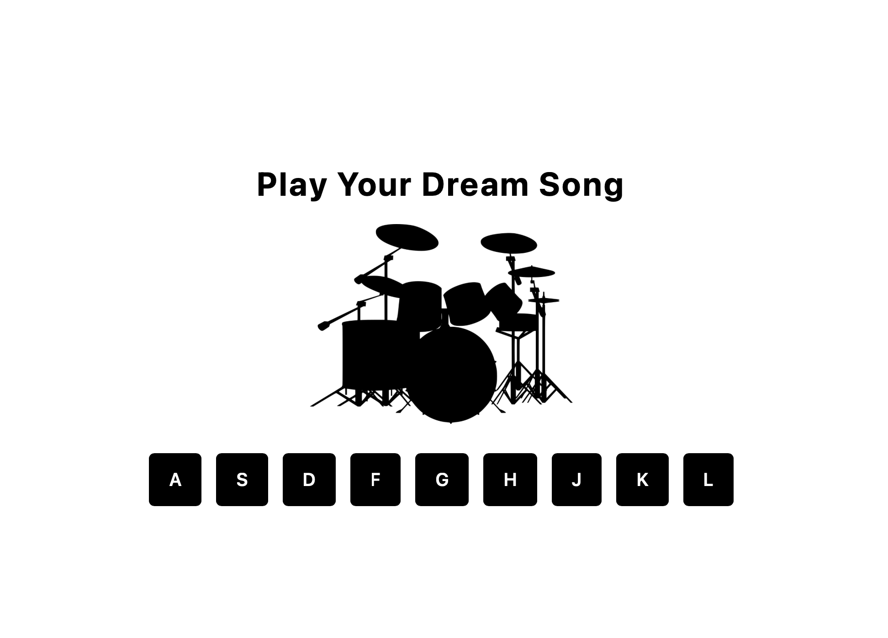

# 🥁 JavaScript Drum Kit

An interactive drum kit that you can play using your keyboard or mouse. Built with **HTML5**, **JavaScript**, and **TailwindCSS**.

## 🔗 Live Demo

[View the App](https://github-halenurincedere.github.io/drum-kit)

---

## ✨ Features

- 🎵 9 different drum sounds
- ⌨️ Keyboard support (A, S, D, F, G, H, J, K, L keys)
- 🖱️ Mouse click support
- 💫 Custom animations for each button
- 📱 Fully responsive layout with TailwindCSS

---

## 🎹 Sound Mapping

| Key | Sound       |
|-----|-------------|
| A   | Clap        |
| S   | Hi-hat      |
| D   | Kick        |
| F   | Open Hat    |
| G   | Boom        |
| H   | Ride        |
| J   | Snare       |
| K   | Tom         |
| L   | Tink        |

---

## 🚀 How to Use

1. Clone or download this repository  
2. Open the `index.html` file in your browser  
3. Press the **A–L** keys or click the buttons to play sounds  
4. Enjoy your custom beat! 🥁